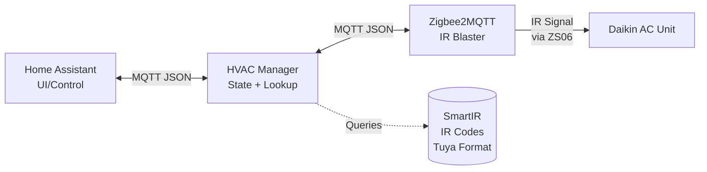

# HVAC Manager

> **A Go Climate Sidecar for Home Assistant, through MQTT and Zigbee**

> **Status:** 🎉 E2E POC Available! Test HA integration now (no IR signals yet)

A standalone Go microservice for intelligent AC control via Zigbee2MQTT. This service acts as a bridge between Home Assistant and Zigbee IR blasters, managing AC state and dispatching pre-translated IR codes from the SmartIR database.

## 🚀 Try the E2E POC!

**NEW:** Test the full Home Assistant integration using your existing MQTT broker!

```bash
# 1. Configure your MQTT broker (where your HA connects)
export MQTT_BROKER="tcp://YOUR_HA_IP:1883"
export MQTT_USERNAME="your_mqtt_user"  # if needed
export MQTT_PASSWORD="your_password"    # if needed

# 2. Run the POC
go run cmd/main.go

# 3. Climate entity appears automatically in Home Assistant! 🎉
#    Check: Settings → Devices & Services → MQTT → "Living Room AC"
```

The POC demonstrates MQTT Discovery, state management, and HA command handling. No IR signals sent yet - perfect for testing integration!

**[🚀 Quick Start Guide →](GETTING-STARTED.md)** | **[📖 Full Setup Guide →](docs/poc-setup.md)**

## Quick Overview

Instead of using static Home Assistant integrations or manual IR code recording, this service:

- **Runs Independently:** Manages AC state and logic in a standalone Go container (perfect for learning Go!)
- **Integrates Seamlessly:** Exposes controls to Home Assistant using MQTT Auto-Discovery (appears as a native Climate entity)
- **Simple & Reliable:** Looks up pre-translated IR codes from SmartIR database based on desired AC state

## Architecture



**Tech Stack:**
- **Language:** Go 1.25.5
- **Communication:** MQTT (Eclipse Paho)
- **Hardware:** Zigbee IR Blaster (Model ZS06) via Zigbee2MQTT
- **UI:** Home Assistant (Web/App)

## Project Status

**✅ Phase 1: Connectivity (Complete)**
- [x] Setup Go environment with MQTT client
- [x] Connect to MQTT Broker
- [x] Verify control by re-sending captured IR commands

**✅ Phase 2: IR Code Database (Complete)**
- [x] SQLite database with schema versioning
- [x] Load SmartIR JSON files (Tuya format)
- [x] Implement state-to-code lookup function
- [x] Handle missing codes gracefully
- [x] Unit tests with real SmartIR data
- [x] CLI tool for database management
- [x] Working demo application

**🎉 Phase 3: E2E POC (Complete)**
- [x] Basic `ACState` struct with validation
- [x] MQTT client wrapper
- [x] Home Assistant MQTT Discovery
- [x] Command handling and state synchronization
- [x] Docker Compose setup for testing
- [x] Full integration without IR signals

**📋 Phase 4: Full Integration (Next)**
- [ ] Connect state management to IR database
- [ ] Implement IR code lookup on state change
- [ ] Publish to Zigbee2MQTT for actual IR transmission
- [ ] Advanced state validation and error recovery

## Key Technical Challenges

### 1. Dynamic Protocol Generation
Daikin ACs use a complex, multi-frame protocol with checksums and time-based rolling codes. We cannot simply record static "On"/"Off" commands. Solution: Implement a protocol generator that constructs commands dynamically.

### 2. Encoding Format Conversion
SmartIR databases use **Broadlink format** (`JgB...`), but our ZS06 hardware requires **Tuya Compressed format** (`C/M...`). Solution: Build a custom encoder that outputs Tuya-compatible strings directly.

## Documentation

### For Developers
- [📐 Architecture](docs/architecture.md) - System design, data flow, and component interactions
- [🔧 Development Guide](docs/development.md) - Setup, building, testing, and contributing
- [📡 API & MQTT](docs/api.md) - MQTT topics, message formats, and HA integration
- [🔢 Protocols](docs/protocols.md) - Daikin protocol and Tuya encoding details
- [📝 IR Code Preparation](docs/ir-code-prep.md) - Converting SmartIR codes to Tuya format

### For AI Agents
- [🤖 AGENTS.md](AGENTS.md) - Project structure, patterns, and context for AI assistants

## Quick Start

### Try the E2E POC (No Hardware Required)

```bash
# Prerequisites: Go 1.25+, Home Assistant with MQTT

# Clone and setup
git clone https://github.com/diogoaguiar/hvac-manager.git
cd hvac-manager
go mod download

# Configure to use your existing MQTT broker
export MQTT_BROKER="tcp://YOUR_HA_BROKER_IP:1883"
export MQTT_USERNAME="mqtt_user"  # optional
export MQTT_PASSWORD="password"    # optional

# Run the POC application
go run cmd/main.go

# The climate entity will auto-discover in Home Assistant!
```

**📖 [Complete POC Setup Guide](docs/poc-setup.md)** - Full instructions with troubleshooting

### Production Build (Future)

```bash
# Build and run (using Make)
make build
./bin/hvac-manager

# See all available commands
make help
```

## Hardware Requirements

- **IR Blaster:** Tuya-compatible Zigbee IR Blaster (ZS06 or equivalent)
  - [Reference listing](https://www.aliexpress.com/item/1005003878194474.html)
- **Zigbee Coordinator:** Any Zigbee2MQTT-compatible coordinator
- **AC Unit:** Daikin AC (initially supporting specific models, expandable)

## Key Resources

- **MQTT Library:** [Eclipse Paho Go Client](https://github.com/eclipse/paho.mqtt.golang)
- **SmartIR Project:** [Home Assistant IR Codes](https://github.com/smartHomeHub/SmartIR)
- **Tuya IR Codec:** [Compression format reference](https://gist.github.com/mildsunrise/1d576669b63a260d2cff35fda63ec0b5)
- **Broadlink→Tuya Converter:** [Community implementations](https://gist.github.com/svyatogor/7839d00303998a9fa37eb079328e4ddaf9)

## Contributing

This project is in active development. Documentation and code are evolving rapidly. Please:
- Check [docs/development.md](docs/development.md) for contribution guidelines
- Ensure changes update relevant documentation
- Test MQTT integration before submitting PRs

## License

[To be determined]

## Project Name

**HVAC Manager** - A Go Climate Sidecar for Home Assistant. The repository is named `hvac-manager` for brevity.
