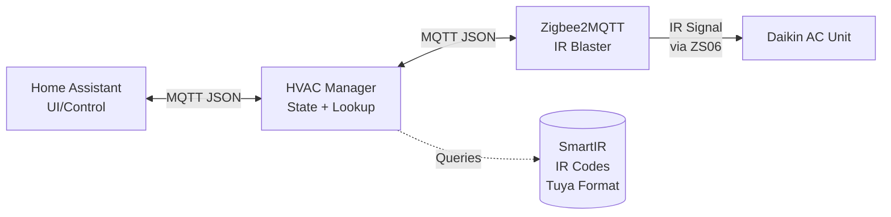

# HVAC Manager

> **A Go Climate Sidecar for Home Assistant, through MQTT and Zigbee**

> **Status:** Archived - See [SmartIR](https://github.com/smartHomeHub/SmartIR) + [tuya-ir](https://github.com/diogoaguiar/tuya-ir) instead.

## About

This was an exploratory project to solve a personal problem (controlling AC units via Zigbee IR blasters in Home Assistant) and gain some hands-on experience with Go and Home Assistant plugin development.

A standalone Go microservice for intelligent AC control via Zigbee2MQTT. It acted as a bridge between Home Assistant and Zigbee IR blasters, managing AC state and dispatching pre-translated IR codes from the SmartIR database.

## Why Archived?

I ultimately decided the solution wasn't good enough in terms of **complexity vs value**. After figuring out how to bridge the gap between my setup (Tuya-based Zigbee IR blasters) and the [SmartIR](https://github.com/smartHomeHub/SmartIR) project, I'd be better off relying on the existing, well-maintained project and simply bridging that gap with auxiliary tools.

The result of that effort is [diogoaguiar/tuya-ir](https://github.com/diogoaguiar/tuya-ir), which handles the IR code format conversion that SmartIR doesn't natively support.

## What I Recommend Instead

- **[SmartIR](https://github.com/smartHomeHub/SmartIR)** - Mature Home Assistant integration for IR-controlled climate devices
- **[diogoaguiar/tuya-ir](https://github.com/diogoaguiar/tuya-ir)** - Bridges the gap for Tuya/Zigbee IR blasters that SmartIR doesn't natively support

## What Was Built

Despite being archived, the project reached a fairly complete state:

- MQTT client with Home Assistant Auto-Discovery (native climate entity)
- SQLite database for SmartIR IR code lookup
- State management with validation and error recovery
- IR code transmission to Zigbee2MQTT
- Device discovery tooling
- Comprehensive test suite

## Was It Worth It?

Absolutely. It was a great learning experience - I got to dig into Go, MQTT, Home Assistant internals, Zigbee protocols, and IR encoding formats. The problem got solved in the end (just via a different path), so it was either way a great success. :)

## Architecture

```mermaid
graph LR
    HA[Home Assistant<br/>UI/Control] <-->|MQTT JSON| GCS[HVAC Manager<br/>State + Lookup]
    GCS <-->|MQTT JSON| Z2M[Zigbee2MQTT<br/>IR Blaster]
    GCS -.->|Queries| DB[(SmartIR<br/>IR Codes<br/>Tuya Format)]
    Z2M -->|IR Signal<br/>via ZS06| AC[Daikin AC Unit]
```

**Tech Stack:** Go, MQTT (Eclipse Paho), SQLite, Zigbee2MQTT, Home Assistant

## Documentation

The docs are preserved for reference:

- [Architecture](docs/architecture.md) - System design and data flow
- [Development Guide](docs/development.md) - Setup, building, and testing
- [Debugging Guide](docs/debugging.md) - Log levels and troubleshooting
- [API & MQTT](docs/api.md) - MQTT topics and message formats
- [Protocols](docs/protocols.md) - Daikin protocol and Tuya encoding details
- [IR Code Preparation](docs/ir-code-prep.md) - Converting SmartIR codes to Tuya format
