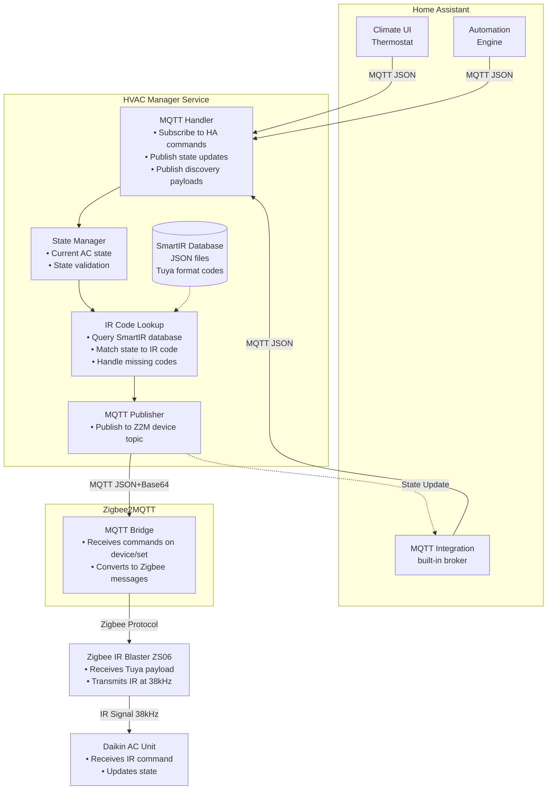

# Architecture Documentation

## System Overview

HVAC Manager is a standalone microservice that bridges Home Assistant and Zigbee2MQTT to provide intelligent control of Daikin air conditioning units. The service maintains AC state and looks up pre-translated IR codes from the SmartIR database to send commands via a Zigbee IR blaster.

**Key Design Choice:** Rather than dynamically generating IR signals, we use a database of pre-translated codes from the SmartIR project. This simplifies implementation while maintaining full functionality.

## Core Principles

1. **Stateful Management:** Maintains full AC state internally; tracks current settings
2. **Code Lookup:** Uses pre-translated IR codes from SmartIR database (Tuya format)
3. **Layer Separation:** Separates state management from IR code lookup from MQTT communication
4. **HA Native Integration:** Uses MQTT Discovery to appear as a first-class Climate entity in Home Assistant
5. **Learning Go:** Code serves as practical example of Go microservice patterns

## System Architecture

### High-Level Component Diagram



### Data Flow Sequence

#### Command Flow: User Sets Temperature to 21°C

```
1. User interacts with HA UI
   Action: Set temperature to 21°C in "cool" mode
   
2. Home Assistant → Go Service
   Topic: homeassistant/climate/living_room/set
   Payload: {"temperature": 21, "mode": "cool"}
   
3. MQTT Handler receives message
   → Validates JSON structure
   → Extracts command parameters
   
4. State Manager processes command
   → Current state: {temp: 24, mode: "cool", fan: "auto"}
   → New state: {temp: 21, mode: "cool", fan: "auto"}
   → Validates transition (valid)
   → Updates internal state
   
5. IR Code Lookup
   → Query SmartIR database: {temp: 21, mode: "cool", fan: "auto"}
   → Find matching entry in 1109_tuya.json
   → Retrieve code: "C/MgAQUBFAUUBRQFFAUUBRQFFAU..." (example)
   
6. Go Service → Zigbee2MQTT
   Topic: zigbee2mqtt/living_room_ir/set
   Payload: {"ir_code_to_send": "C/MgAQUBFAUU..."}
   
7. Zigbee2MQTT → IR Blaster
   Protocol: Zigbee
   Command: Send IR with Tuya payload
   
8. IR Blaster transmits
   → Decompresses Tuya payload to timings
   → Modulates 38kHz carrier
   → Transmits infrared signal
   
9. AC Unit receives and processes
   → Updates temperature to 21°C
   → Maintains cool mode
   
10. Go Service → Home Assistant (state update)
    Topic: homeassistant/climate/living_room/state
    Payload: {"temperature": 21, "mode": "cool", "fan_mode": "auto"}
    
11. HA UI updates
    → Displays new temperature setting
    → User sees confirmation
```

## Component Details

### MQTT Handler

**Responsibilities:**
- Establish and maintain MQTT broker connection
- Subscribe to relevant topics on startup
- Parse incoming messages (JSON)
- Route commands to appropriate handlers
- Publish outgoing messages (commands, state updates)
- Handle connection failures and reconnection

**Key Topics:**
- `homeassistant/climate/+/set` (subscribe)
- `zigbee2mqtt/+/set` (publish)
- `homeassistant/climate/+/state` (publish)
- `homeassistant/climate/+/config` (publish, once on startup)

### State Manager

**Responsibilities:**
- Maintain current AC state in memory
- Validate state transitions
- Enforce constraints (e.g., temp ranges, valid mode combinations)
- Track last command timestamp (for rate limiting)
- Provide state query interface

**State Schema:**
```go
type ACState struct {
    Power       bool      // true = on, false = off
    Mode        Mode      // cool, heat, fan, dry, auto
    Temperature float32   // 16-32°C (model-dependent)
    FanSpeed    FanSpeed  // auto, quiet, 1-5
    SwingMode   SwingMode // off, vertical, horizontal, both
    LastUpdate  time.Time
}
```

### IR Code Lookup

**Responsibilities:**
- Query SmartIR database for IR codes matching desired AC state
- Handle format conversion (Broadlink → Tuya) if needed
- Implement fallback logic for missing exact matches
- Validate IR code exists before transmission
- Return error for unsupported states

**Code Lookup Logic:**

1. **Exact State Matching**
   - Primary strategy: Find exact match for `(mode, temperature, fan_speed)` combination
   - Query: `SELECT ir_code FROM ir_codes WHERE model_id=? AND mode=? AND temperature=? AND fan_speed=?`
   - If found: Return IR code immediately

2. **Fallback Strategy** (when exact match not found)
   - **Temperature rounding**: Try nearest valid temperature (e.g., 21.5°C → 21°C or 22°C)
   - **Fan speed fallback**: If specific fan speed unavailable, try "auto" fan mode
   - **Mode validation**: Never fallback on mode changes (fail explicitly)
   - Priority: Exact match > Temperature fallback > Fan fallback > Error

3. **Validation Rules**
   - Temperature must be in valid range (typically 16-30°C, model-dependent)
   - Mode must be supported by AC model (cool, heat, fan, dry, auto)
   - Fan speed must be valid for mode (some modes restrict fan options)
   - Database must contain at least one code for requested mode

4. **Special Cases**
   - **Off mode**: Uses separate `LookupOffCode()` - single code per model
   - **Power state**: Tracked separately from other state (IR codes include power on)
   - **Invalid states**: Return error immediately without database query

**SmartIR Code Database:**
- **Source**: Pre-translated IR codes from [SmartIR project](https://github.com/smartHomeHub/SmartIR)
- **Format**: JSON files in `docs/smartir/reference/` directory
- **Structure**: Maps AC states (temp, mode, fan) to Tuya-format IR codes
- **Tuya Format**: Base64-encoded compressed pulse timings, prefixed with `C/` or `M/`
- **Example Entry**: `{"mode": "cool", "temp": 21, "fan": "auto"}` → `"C/MgAQUBFAU..."`
- **Conversion**: Broadlink format automatically converted to Tuya during import

**Implementation**: See [internal/database/database.go](../internal/database/database.go) and [internal/integration/ir_sender.go](../internal/integration/ir_sender.go)

**Responsibilities:**
- Load SmartIR JSON database files on startup
- Find IR code matching desired AC state
- Handle missing codes gracefully (fallback strategies)
- Cache frequently used codes

**Database Schema (SmartIR Tuya format):**
```json
{
  "supportedModes": ["auto", "cool", "dry", "fan_only", "heat"],
  "supportedFanSpeeds": ["auto", "low", "medium", "high"],
  "minTemperature": 16,
  "maxTemperature": 32,
  "commands": {
    "off": "C/...",
    "cool": {
      "16": {"auto": "C/MgAQ...", "low": "C/MgAR..."},
      "21": {"auto": "C/MgAQUBFAU...", "low": "C/..."},
      "32": {"auto": "C/...", "high": "C/..."}
    },
    "heat": { /* similar structure */ }
  }
}
```

**Lookup Algorithm:**
```go
// Simplified pseudocode
func LookupCode(state ACState) (string, error) {
    // 1. Check if mode exists
    if !db.SupportedModes.Contains(state.Mode) {
        return "", ErrUnsupportedMode
    }
    
    // 2. Find temperature (exact match or closest)
    temp := state.Temperature
    if !db.HasExactTemp(state.Mode, temp) {
        temp = db.FindClosestTemp(state.Mode, temp)
    }
    
    // 3. Find fan speed (exact or fallback to "auto")
    fan := state.FanSpeed
    if !db.HasFanSpeed(state.Mode, temp, fan) {
        fan = "auto"
    }
    
    // 4. Return code
    return db.Commands[state.Mode][temp][fan], nil
}
```

## MQTT Discovery (Home Assistant)

On service startup, the Go service publishes a discovery payload that tells Home Assistant:
- Entity type (Climate)
- Available features (modes, fan speeds, swing)
- Command and state topics
- Value templates for parsing

**Discovery Topic Format:**
```
homeassistant/climate/[device_id]/config
```

**Discovery Payload Example:**
```json
{
  "name": "Living Room AC",
  "unique_id": "daikin_living_room",
  "mode_command_topic": "go-climate/living_room/set",
  "mode_state_topic": "go-climate/living_room/state",
  "temperature_command_topic": "go-climate/living_room/set",
  "temperature_state_topic": "go-climate/living_room/state",
  "modes": ["off", "cool", "heat", "dry", "fan_only", "auto"],
  "fan_modes": ["auto", "quiet", "1", "2", "3", "4", "5"],
  "swing_modes": ["off", "vertical", "horizontal", "both"],
  "min_temp": 16,
  "max_temp": 32,
  "temp_step": 1,
  "precision": 1.0
}
```

## Error Handling & Resilience

### MQTT Connection Failures
- Auto-reconnect with exponential backoff
- Resubscribe to topics on reconnection
- Queue commands during disconnection (with size limit)
- Republish discovery payload on reconnection

### Invalid Commands
- Validate all incoming JSON against schema
- Reject invalid temperature ranges
- Log invalid commands with details
- Respond with error state update to HA

### State Inconsistencies
- Track last successful command timestamp
- Implement command rate limiting (prevent spam)
- Allow manual state refresh commands
- Persist state to disk periodically (future enhancement)

### Hardware Failures
- Detect IR blaster offline (via Z2M availability)
- Queue commands when blaster unavailable
- Retry failed transmissions (configurable limit)
- Alert HA via entity availability flag

## Performance Considerations

### Latency Budget
```
User action → HA:        ~10-50ms
HA → MQTT → Go:          ~5-20ms
Protocol generation:     <1ms (target)
Encoding:                <1ms (target)
Go → MQTT → Z2M:         ~5-20ms
Z2M → Zigbee → Blaster: ~20-100ms
IR transmission:         ~100-200ms (protocol-dependent)
AC response:             ~50-200ms

Total: ~200-600ms (target under 500ms)
```

### Optimization Strategies
- Pre-compute common state transitions
- Cache generated IR sequences (future)
- Use connection pooling for MQTT
- Minimize allocations in hot paths
- Profile encoding/compression algorithms

## Security Considerations

### Current State (Phase 1-2)
- No authentication on MQTT broker (local network only)
- No encryption in transit
- No access control

### Future Enhancements (Phase 4+)
- MQTT broker authentication (username/password)
- TLS for MQTT connections
- Rate limiting per client
- Command validation and sanitization
- Audit logging of all commands

## Deployment Architecture

### Containerization
```dockerfile
FROM golang:1.25-alpine AS builder
WORKDIR /build
COPY go.mod go.sum ./
RUN go mod download
COPY . .
RUN go build -o go-climate-sidecar ./cmd

FROM alpine:latest
RUN apk --no-cache add ca-certificates
COPY --from=builder /build/go-climate-sidecar /usr/local/bin/
CMD ["go-climate-sidecar"]
```

### Environment Variables
```
MQTT_BROKER=tcp://homeassistant.local:1883
MQTT_USERNAME=go-climate
MQTT_PASSWORD=secret
DEVICE_ID=living_room_ac
ZIGBEE_DEVICE_ID=ir_blaster_01
LOG_LEVEL=info
```

### Resource Requirements
- CPU: <10% of 1 core (idle), <30% during command generation
- Memory: ~20-50MB
- Network: <1KB/s average, <10KB/s burst
- Storage: <10MB (binary + config)

## Monitoring & Observability

### Metrics (Future)
- Commands processed per minute
- Average command latency
- MQTT connection uptime
- IR transmission success rate
- State update frequency

### Logging
- Structured JSON logs
- Levels: DEBUG, INFO, WARN, ERROR
- Key events:
  - MQTT connection/disconnection
  - Commands received
  - IR codes generated
  - State updates published
  - Errors and retries

### Health Checks
- HTTP endpoint: `/health` (future)
- MQTT connectivity check
- Last successful command timestamp
- Memory usage check

## Testing Strategy

### Unit Tests
- Protocol generation (verify checksums, frame structure)
- Tuya encoding (verify compression, decompression round-trip)
- State transitions (validate constraints)
- JSON parsing (schema validation)

### Integration Tests
- MQTT pub/sub flows (use test broker)
- End-to-end command processing (mock hardware)
- Discovery payload parsing by HA (validate structure)

### Hardware-in-the-Loop Tests
- Real IR blaster transmission
- Real AC unit response verification
- Timing accuracy validation

## Future Architecture Considerations

### Multi-Device Support
- Support multiple AC units simultaneously
- Per-device state management
- Dynamic device discovery

### Advanced Features
- Temperature scheduling
- Energy usage tracking (via power monitoring)
- Smart modes (eco, turbo, night)
- Zone control (multi-split systems)

### Protocol Extensions
- Support additional AC brands (Mitsubishi, Fujitsu, etc.)
- Learn mode (capture and replay unknown codes)
- Hybrid mode (fallback to SmartIR database)

## References

- MQTT Climate Platform: https://www.home-assistant.io/integrations/climate.mqtt/
- MQTT Discovery: https://www.home-assistant.io/integrations/mqtt/#mqtt-discovery
- Zigbee2MQTT Devices: https://www.zigbee2mqtt.io/devices/
- Eclipse Paho Go: https://github.com/eclipse/paho.mqtt.golang
