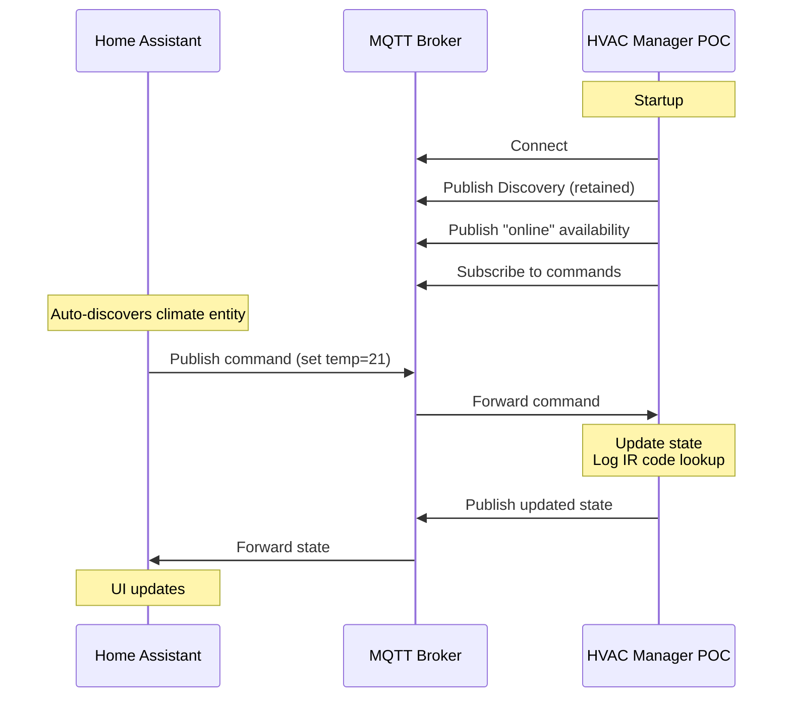

# E2E POC Setup Guide

This guide shows you how to run the HVAC Manager E2E proof-of-concept with your existing Home Assistant installation.

## What This POC Demonstrates

✅ MQTT connectivity to your existing broker  
✅ Home Assistant MQTT Discovery (climate entity auto-appears)  
✅ AC state management (temperature, mode, fan)  
✅ Command processing from Home Assistant  
✅ State synchronization back to HA  

❌ **NOT included:** Actual IR signal transmission (logs only)

## Prerequisites

- Go 1.25+ installed
- Home Assistant with MQTT integration configured
- Access to your MQTT broker (hostname/IP and credentials)

## Quick Start

### Method 1: Using run-poc.sh (Easiest)

```bash
# 1. Configure your MQTT broker
export MQTT_BROKER="tcp://YOUR_BROKER_IP:1883"
export MQTT_USERNAME="your_username"  # if needed
export MQTT_PASSWORD="your_password"  # if needed

# 2. Run the setup script
./run-poc.sh
```

The script will check dependencies, build, and run the application.

### Method 2: Using .env file

```bash
# 1. Copy example configuration
cp .env.example .env

# 2. Edit .env with your broker details
nano .env  # or use your favorite editor

# 3. Load configuration and run
set -a; source .env; set +a
go run cmd/main.go
```

### Method 3: Manual (Direct)

### Method 3: Manual (Direct)

```bash
# Export environment variables directly
export MQTT_BROKER="tcp://YOUR_BROKER_IP:1883"

# Optional: If your broker requires authentication
export MQTT_USERNAME="your_username"
export MQTT_PASSWORD="your_password"

# Optional: Customize device ID (defaults to "living_room")
export DEVICE_ID="living_room"
```

**Example configurations:**
```bash
# Local broker without auth
export MQTT_BROKER="tcp://192.168.1.100:1883"

# Home Assistant's built-in Mosquitto add-on
export MQTT_BROKER="tcp://homeassistant.local:1883"
export MQTT_USERNAME="mqtt_user"
export MQTT_PASSWORD="your_password"

# Remote broker
export MQTT_BROKER="tcp://mqtt.example.com:1883"
```

### 2. Run the POC Application

```bash
go run cmd/main.go
```

Expected output:
```
🌡️  HVAC Manager - E2E POC
==================================================
Config: Broker=tcp://localhost:1883, Device=living_room
MQTT: Connected to broker
Initial state: Mode: off, Temp: 22.0°C, Fan: auto, Power: false
✅ Published discovery to: homeassistant/climate/living_room/config
📤 Published state: Mode: off, Temp: 22.0°C, Fan: auto, Power: false

✅ POC is running! Integration points:
   📡 MQTT Broker: tcp://localhost:1883
   🏠 HA Device ID: living_room
   📥 Listening on: homeassistant/climate/living_room/set
   📤 State topic: homeassistant/climate/living_room/state

ℹ️  This POC does NOT send IR signals - commands are logged only.
   Press Ctrl+C to stop
```

### 3. Test with MQTT Client

You can test the POC without Home Assistant using an MQTT client:

```bash
# Subscribe to state updates
mosquitto_sub -h localhost -t "homeassistant/climate/living_room/state"

# Send a command (in another terminal)
mosquitto_pub -h localhost -t "homeassistant/climate/living_room/set" \
  -m '{"temperature": 21, "mode": "cool", "fan_mode": "auto"}'
```

### 3. Verify in Home Assistant

#### Automatic Discovery (Default)

Since you're connected to the same MQTT broker as Home Assistant, the climate entity should appear automatically!

1. Run the POC application (see above)
2. In Home Assistant, go to **Settings → Devices & Services → MQTT**
3. Look for "Living Room AC" device under MQTT integration
4. The climate entity will be named `climate.living_room_ac`

**If the device doesn't appear:**
- Verify MQTT discovery is enabled in HA (it's enabled by default)
- Check the POC logs for connection errors
- Restart the POC to re-publish the discovery payload
- Check MQTT logs in HA: **Settings → System → Logs** (filter for "mqtt")

#### Manual Configuration (If Auto-Discovery Fails)

Only needed if auto-discovery doesn't work. Add to `configuration.yaml`:

```yaml
mqtt:
  climate:
    - name: "Living Room AC"
      unique_id: "hvac_manager_living_room"
      state_topic: "homeassistant/climate/living_room/state"
      command_topic: "homeassistant/climate/living_room/set"
      availability_topic: "homeassistant/climate/living_room/availability"
      modes:
        - "off"
        - "cool"
        - "heat"
        - "dry"
        - "fan_only"
        - "auto"
      fan_modes:
        - "auto"
        - "low"
        - "medium"
        - "high"
      min_temp: 16
      max_temp: 30
      temp_step: 1
      temperature_unit: "C"
```

Then restart Home Assistant.

## Configuration Reference

All configuration via environment variables:

```bash
# Required
export MQTT_BROKER="tcp://YOUR_BROKER_IP:1883"  # Your MQTT broker URL

# Optional (defaults shown)
export DEVICE_ID="living_room"                   # Device identifier for MQTT topics
export MQTT_USERNAME=""                          # Username if broker requires auth
export MQTT_PASSWORD=""                          # Password if broker requires auth

go run cmd/main.go
```

**Finding your MQTT broker address:**
- Check your Home Assistant MQTT integration settings
- Common values: `tcp://homeassistant.local:1883`, `tcp://192.168.1.X:1883`
- If using Mosquitto add-on, use your HA server's IP/hostname

## Testing the Full Flow

1. **Start the POC** (as above)
2. **Open Home Assistant** and navigate to the climate entity
3. **Change temperature** in HA UI → POC logs show command received
4. **Change mode** (cool/heat/fan) → State updates in HA
5. **Check POC logs** to see:
   - Received commands
   - State changes
   - What IR codes would be sent (logged, not transmitted)

### Example Log Output

```
📥 Received command: {"temperature":21,"mode":"cool"}
📋 Parsed command:
{
  "temperature": 21,
  "mode": "cool"
}
🌡️  Temperature set to: 21.0°C
🔄 Mode set to: cool
💡 [POC] Would look up IR code for: Mode: cool, Temp: 21.0°C, Fan: auto, Power: true
💡 [POC] Would publish to: zigbee2mqtt/ir-blaster/set
📤 Published state: Mode: cool, Temp: 21.0°C, Fan: auto, Power: true
```

## MQTT Topics

| Topic | Direction | Purpose |
|-------|-----------|---------|
| `homeassistant/climate/{device}/config` | Publish | Discovery payload (retained) |
| `homeassistant/climate/{device}/set` | Subscribe | Commands from HA |
| `homeassistant/climate/{device}/state` | Publish | Current state to HA |
| `homeassistant/climate/{device}/availability` | Publish | Online/offline status |

## Troubleshooting

### "Connection refused" error

```
MQTT: connection failed: network Error : dial tcp 127.0.0.1:1883: connect: connection refused
```

**Solutions:**
1. Verify MQTT_BROKER is set correctly:
   ```bash
   echo $MQTT_BROKER
   ```
2. Check your MQTT broker is running (check in HA MQTT integration)
3. Test connectivity:
   ```bash
   mosquitto_pub -h YOUR_BROKER_IP -t "test" -m "hello"
   ```
4. Verify firewall allows port 1883

### Climate entity not appearing in HA

1. Check MQTT integration is enabled in HA: **Settings → Devices & Services → MQTT**
2. Verify MQTT discovery is enabled (default: yes)
3. Check POC logs show "Published discovery to: homeassistant/climate/living_room/config"
4. Monitor MQTT traffic:
   ```bash
   mosquitto_sub -h YOUR_BROKER_IP -t "homeassistant/#" -v
   ```
5. Restart POC to re-publish discovery

### Authentication errors

```
MQTT: connection failed: Not Authorized
```

**Solutions:**
1. Verify credentials are correct
2. Check user has permissions in MQTT broker
3. If using Mosquitto add-on in HA, create a dedicated user:
   - Settings → People → Users → Add User
   - Enable "Can only login from local network"
   - Use these credentials in MQTT_USERNAME/PASSWORD

### State not updating in HA

1. Check POC logs show state publications
2. Use MQTT client to verify messages are being published:
   ```bash
   mosquitto_sub -h YOUR_BROKER_IP -t "homeassistant/climate/#" -v
   ```
3. Check HA is receiving messages (check MQTT integration in HA)
4. Verify state topic matches what HA expects

## Testing Without Home Assistant

If you want to test without HA, you can use the included docker-compose setup:

```bash
# Start standalone MQTT broker
docker-compose up -d

# Configure to use local broker
export MQTT_BROKER="tcp://localhost:1883"
unset MQTT_USERNAME MQTT_PASSWORD

# Run POC
go run cmd/main.go

# Test with MQTT client
mosquitto_sub -h localhost -t "homeassistant/#" -v
mosquitto_pub -h localhost -t "homeassistant/climate/living_room/set" \
  -m '{"temperature": 21, "mode": "cool"}'
```

This is useful for development/testing without affecting your production HA setup.

## Cleanup

```bash
# Stop POC (Ctrl+C in POC terminal)

# If using docker-compose broker
docker-compose down

# Remove volumes (optional)
docker-compose down -v
```

## Next Steps

This POC validates the HA integration flow. Next phases will add:

- ✅ Phase 3: Full state management with validation
- ✅ Phase 4: IR code lookup from database  
- ✅ Phase 5: Actual IR signal transmission via Zigbee2MQTT

## Architecture



## Useful MQTT Commands

```bash
# Monitor all topics
mosquitto_sub -h localhost -t "#" -v

# Monitor only HA topics
mosquitto_sub -h localhost -t "homeassistant/#" -v

# Send various commands
mosquitto_pub -h localhost -t "homeassistant/climate/living_room/set" -m '{"mode":"cool"}'
mosquitto_pub -h localhost -t "homeassistant/climate/living_room/set" -m '{"temperature":24}'
mosquitto_pub -h localhost -t "homeassistant/climate/living_room/set" -m '{"fan_mode":"high"}'
mosquitto_pub -h localhost -t "homeassistant/climate/living_room/set" -m '{"mode":"off"}'
```
