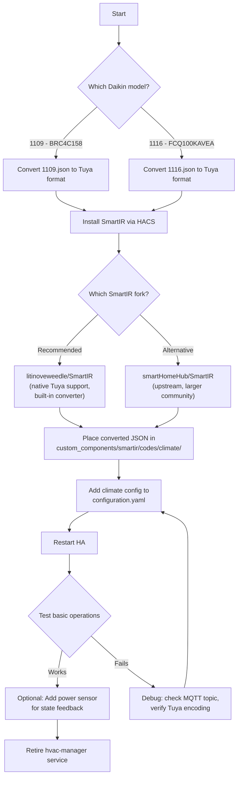

# SmartIR vs hvac-manager: Migration Analysis

## Executive Summary

**Can you replace hvac-manager with SmartIR + a Tuya device code JSON?** Yes, for the core
use case (controlling your Daikin AC via a Tuya Zigbee IR blaster through Home Assistant).
The trade-offs are real but manageable — you'd lose some custom logic and gain significant
simplification and community support.

---

## Architecture Comparison

### Current: hvac-manager (Go microservice)

```
┌─────────────────┐     MQTT      ┌──────────────────┐     MQTT      ┌────────────────┐
│  Home Assistant  │──────────────▶│   hvac-manager   │──────────────▶│  Zigbee2MQTT   │
│  (Climate UI)    │◀──────────────│   (Go service)   │               │                │
│                  │  state/disc.  │                   │               │  ┌────────────┐│
│  MQTT Discovery  │               │ ┌───────────────┐│               │  │ IR Blaster ││
│  auto-registers  │               │ │ SQLite DB     ││               │  │ (ZS06)     ││
│  climate entity  │               │ │ (Tuya codes)  ││               │  └────────────┘│
└─────────────────┘               │ ├───────────────┤│               └────────────────┘
                                   │ │ State Manager ││                       │
                                   │ ├───────────────┤│                    IR signal
                                   │ │ Fallback Logic││                       │
                                   │ ├───────────────┤│                       ▼
                                   │ │ Broadlink→Tuya││               ┌────────────────┐
                                   │ │ Converter     ││               │   Daikin AC     │
                                   │ └───────────────┘│               └────────────────┘
                                   └──────────────────┘
```

### Proposed: SmartIR (HA custom component)

```
┌──────────────────────────────────┐     MQTT      ┌────────────────┐
│         Home Assistant           │──────────────▶│  Zigbee2MQTT   │
│                                  │               │                │
│  ┌────────────────────────────┐  │               │  ┌────────────┐│
│  │  SmartIR Custom Component  │  │               │  │ IR Blaster ││
│  │                            │  │               │  │ (ZS06)     ││
│  │  ┌──────────────────────┐  │  │               │  └────────────┘│
│  │  │ Tuya Device Code JSON│  │  │               └────────────────┘
│  │  │ (pre-converted)      │  │  │                       │
│  │  ├──────────────────────┤  │  │                    IR signal
│  │  │ Climate Entity       │  │  │                       │
│  │  │ (native HA)          │  │  │                       ▼
│  │  ├──────────────────────┤  │  │               ┌────────────────┐
│  │  │ MQTT Controller      │  │  │               │   Daikin AC     │
│  │  │ (publishes verbatim) │  │  │               └────────────────┘
│  │  └──────────────────────┘  │  │
│  └────────────────────────────┘  │
│                                  │
│  configuration.yaml:             │
│    climate:                      │
│      - platform: smartir         │
│        device_code: 1109         │
│        controller_data:          │
│          zigbee2mqtt/IR_BLASTER  │
│          /set/ir_code_to_send    │
└──────────────────────────────────┘
```

**Key difference:** SmartIR eliminates the entire middle service. The device code JSON file
(with pre-converted Tuya codes) lives inside HA, and SmartIR publishes codes directly to
the Zigbee2MQTT MQTT topic.

---

## What You Would Need To Do

### Step 1: Convert your Daikin SmartIR JSON to Tuya format

You already have the conversion tools. Take `1109.json` (Broadlink Base64) and convert all
codes to Tuya format. The output JSON would look like:

```json
{
  "manufacturer": "Daikin",
  "supportedModels": ["BRC4C158"],
  "commandsEncoding": "Raw",
  "supportedController": "MQTT",
  "minTemperature": 16,
  "maxTemperature": 32,
  "precision": 1,
  "operationModes": ["fan_only", "dry", "cool", "heat"],
  "fanModes": ["low", "medium", "high"],
  "commands": {
    "off": "<tuya-encoded-base64>",
    "cool": {
      "low": {
        "16": "<tuya-encoded-base64>",
        ...
      }
    }
  }
}
```

### Step 2: Install SmartIR

Via HACS or manual installation. The **litinoveweedle/SmartIR** fork is recommended for
Tuya/Zigbee2MQTT users — it has native ZS06/UFO-R11 support and a built-in conversion tool.

### Step 3: Configure in HA

```yaml
smartir:

climate:
  - platform: smartir
    name: Living Room AC
    unique_id: living_room_ac
    device_code: 1109
    controller_data: zigbee2mqtt/ir-blaster/set/ir_code_to_send
    temperature_sensor: sensor.living_room_temperature   # optional
    humidity_sensor: sensor.living_room_humidity          # optional
    power_sensor: binary_sensor.ac_power                 # optional
```

### Step 4: Retire hvac-manager

Stop the Go service, remove the Docker container / systemd unit.

---

## What You Lose

### 1. Intelligent Fallback Logic ❌

**hvac-manager** has a priority-based fallback when an exact IR code match is missing:
1. Exact match (mode + temp + fan)
2. Fan fallback chain (auto → low → medium → high)
3. Mode + temp only (ignore fan)
4. Mode only (for fan_only/dry)

**SmartIR** does a simple dict lookup: `commands[mode][fan][temp]`. If the exact combination
doesn't exist in the JSON, the command fails silently — no fallback, no alternative attempted.

**Impact:** Medium. If your Daikin 1109 JSON has complete codes for all mode/fan/temp
combinations (which it does — 4 modes × 3 fan speeds × 17 temperatures = 204 codes + off),
this fallback logic would never trigger anyway. It's only relevant if codes are missing.

### 2. State Revert on IR Failure ❌

**hvac-manager** reverts internal state to the last known-good state when IR transmission
fails (e.g., MQTT publish failure, blaster disconnected).

**SmartIR** always updates internal state optimistically — if the IR command fails to
transmit, the UI still shows the new state.

**Impact:** Low-Medium. IR-over-Zigbee is generally reliable once paired. The main failure
scenario is the IR blaster being offline, which both systems would struggle with equally
(neither gets ACK from the AC unit itself).

### 3. Structured Go Logging ❌

**hvac-manager** has detailed, level-based logging with contextual information about
database queries, MQTT messages, fallback attempts, and IR code lookups.

**SmartIR** has minimal Python logging via HA's standard logger.

**Impact:** Low for production use. Useful during initial setup/debugging, but once working,
you rarely need detailed IR logs.

### 4. SQLite Database for IR Codes ❌

**hvac-manager** stores codes in SQLite with indexed lookups.

**SmartIR** loads the JSON file into memory as a Python dict.

**Impact:** None functionally. The JSON approach is simpler and the dataset (a few hundred
codes) is trivially small.

### 5. Independent Service Resilience ❌

**hvac-manager** runs as a standalone service — if HA restarts, the service stays up and
maintains state.

**SmartIR** is a HA component — it restarts with HA. State is restored from HA's state
database on restart.

**Impact:** Negligible. HA state restoration works well for this use case.

### 6. Swing Mode Support (1116.json) ⚠️

Your `1116.json` (Daikin FCQ100KAVEA) has `swingModes: ["off", "on"]`. Your current
`hvac-manager` loader does NOT support swing modes (the `SmartIRCommands` struct only
handles 3 levels of nesting: `mode → fan → temp`).

**SmartIR** natively supports swing modes with 4-level nesting:
`mode → fan → swing → temp`.

**Impact:** If you need model 1116 in the future, SmartIR actually handles this better
out of the box.

---

## What You Gain

### 1. Zero Infrastructure ✅

No Go binary to build, deploy, monitor, or update. No SQLite database to manage. No
separate process to keep running. Everything lives inside HA.

### 2. Native HA Integration ✅

SmartIR creates a standard `climate` entity that:
- Appears in HA's entity registry with proper device info
- Works with all HA automations, scripts, and scenes natively
- Shows in Lovelace climate cards without custom configuration
- Supports HA's built-in state persistence and restoration
- Compatible with voice assistants (Alexa, Google Home) through HA

Your hvac-manager achieves this via MQTT Discovery, which works well but adds a layer
of indirection.

### 3. Community Device Code Library ✅

SmartIR has **358 climate device code files** from the community. If you get a different
AC brand or model in the future, there's likely already a code file available.

### 4. Power Sensor Integration ✅

SmartIR supports `power_sensor` — a `binary_sensor` (e.g., from a smart plug) that
detects actual AC power state. When the physical remote is used to turn the AC on/off,
SmartIR updates its state accordingly.

**hvac-manager** does not have this feature.

### 5. Temperature & Humidity Sensors ✅

SmartIR displays current room temperature and humidity from external sensors in the
climate card, providing a richer UI experience.

### 6. Simpler Configuration ✅

SmartIR: ~8 lines of YAML + a JSON file.
hvac-manager: `.env` file + build/deploy pipeline + database setup + service management.

### 7. HACS Updates ✅

SmartIR (via HACS) can auto-update, receive bug fixes, and get new features from the
community without any manual intervention.

### 8. Swing Mode Support ✅

SmartIR natively supports swing modes, which your hvac-manager currently doesn't
handle (your 1116.json would need additional loader/schema work).

### 9. Multi-Device Is Built-In ✅

Adding a second AC is just another `climate` entry in `configuration.yaml`:

```yaml
climate:
  - platform: smartir
    name: Living Room AC
    device_code: 1109
    controller_data: zigbee2mqtt/living-room-ir/set/ir_code_to_send

  - platform: smartir
    name: Bedroom AC
    device_code: 1116
    controller_data: zigbee2mqtt/bedroom-ir/set/ir_code_to_send
```

Your hvac-manager's Phase 6 (multi-device) is not yet implemented.

---

## Feature Comparison Matrix

| Feature                          | hvac-manager      | SmartIR           | Winner       |
|----------------------------------|-------------------|-------------------|--------------|
| Basic climate control            | ✅                | ✅                | Tie          |
| HA Climate entity                | ✅ (MQTT Disc.)   | ✅ (native)       | SmartIR      |
| Temperature control (16-32°C)    | ✅                | ✅                | Tie          |
| Fan modes (low/med/high)         | ✅                | ✅                | Tie          |
| Swing modes                      | ❌ (not loaded)   | ✅                | SmartIR      |
| Tuya IR blaster support          | ✅ (native)       | ✅ (via MQTT)     | Tie          |
| Broadlink→Tuya conversion        | ✅ (built-in Go)  | ✅ (community)    | Tie          |
| Fallback code lookup             | ✅ (4-level)      | ❌                | hvac-manager |
| State revert on failure          | ✅                | ❌                | hvac-manager |
| Power sensor feedback            | ❌                | ✅                | SmartIR      |
| External temp/humidity display   | ❌                | ✅                | SmartIR      |
| Multi-device support             | ❌ (Phase 6)      | ✅                | SmartIR      |
| Structured logging               | ✅                | ❌                | hvac-manager |
| Auto-updates (HACS)              | ❌                | ✅                | SmartIR      |
| Community device codes           | ❌ (manual)       | ✅ (358 files)    | SmartIR      |
| No external service to run       | ❌                | ✅                | SmartIR      |
| Voice assistant compatible       | ✅ (via HA)       | ✅ (via HA)       | Tie          |
| HA automations/scenes            | ✅ (via HA)       | ✅ (via HA)       | Tie          |

---

## Risk Assessment

### Low Risk
- **Code conversion quality**: You already verified Broadlink→Tuya conversion works. The
  same SmartIR JSON codes are used, just consumed differently.
- **HA compatibility**: SmartIR is one of the most popular HA custom integrations (2,600+
  stars, 284 contributors).
- **Rollback**: Your hvac-manager code stays in git. You can switch back anytime.

### Medium Risk
- **State desync without power sensor**: If someone uses the physical remote, SmartIR
  won't know. Mitigated by adding a power-monitoring smart plug.
- **SmartIR maintenance**: The upstream `smartHomeHub/SmartIR` repo has periods of slow
  maintenance. The `litinoveweedle/SmartIR` fork is actively maintained as of 2025.

### Low Concern
- **Fallback logic loss**: Your Daikin 1109 JSON has complete code coverage for all
  mode/fan/temp combinations. The fallback logic in hvac-manager would rarely (if ever)
  trigger with a complete code set.

---

## Recommended Approach



---

## Conversion Path for Your Codes

You can reuse your existing Go converter to produce the Tuya JSON. Alternatively, the
`litinoveweedle/SmartIR` fork includes a built-in conversion tool, or you can use the
community Python script (`broadlink_to_tuya.py` — already in your repo at
`docs/smartir/reference/broadlink_to_tuya.py`).

### Quick conversion using your existing tools

```bash
# Use the db tool to load + convert, then export
# Or use the Python reference script directly:
cd docs/smartir/reference
python broadlink_to_tuya.py 1109.json > 1109_tuya.json
```

The output `1109_tuya.json` would be placed at:
```
<ha-config>/custom_components/smartir/codes/climate/1109.json
```

---

## Conclusion

**SmartIR is the pragmatic choice** for your goal of integrating the Daikin AC with Home
Assistant. Your hvac-manager is a well-engineered piece of software, but it reimplements
functionality that SmartIR provides as a mature, community-supported HA component. The
features you'd lose (fallback logic, state revert) are edge cases for a device with
complete IR code coverage, while the features you'd gain (power sensor, temp display,
multi-device, swing modes, zero infrastructure) are practical day-to-day improvements.

The main value your hvac-manager provided was the **Broadlink→Tuya conversion pipeline**,
which solved a real gap. That conversion only needs to run once — after that, the Tuya
JSON file is static and SmartIR can consume it directly.
